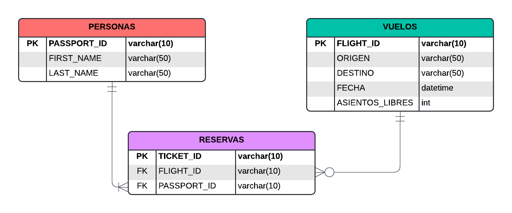

# Sistema de Gestión de Aerolínea 🛫

Este sistema permite realizar la operación básica de una aerolínea, con acciones como el agendamiento y gestión de
vuelos, el registro de pasajeros o la asignación de reservas de vuelos a pasajeros.

## **Importante ⚠️**
Dada la naturaleza del despliegue de la aplicación, para poder garantizar su correcto funcionamiento,
es necesario desactivar un ajuste de seguridad del navegador, de lo contrario no será posible que la API sea consumida.

## Tecnologías

- **Frontend:** React (Next.js) + Componentes de la librería shadcn/ui
- **Backend:** Java (Spring Boot)
- **Base de datos:** H2 embebida

## Arquitectura de la aplicación

### Base de datos
Todo el funcionamiento de la aplicación está basado en las tres tablas que componen la base de datos:

Dos tablas definen las dos entidades principales que se deben tener en cuenta en este contexto, vuelos y pasajeros,
mientras que la tercera tabla define la relación entre esas entidades, que se logra a través de una reserva.

### Diagrama de paquetes
En el componente backend de la aplicación, basándose en la estructura anterior, se crearon las diferentes clases de Java
para cumplir con todas las tareas de estructuración, conexión con el front, conexión y mapeo de la base de datos y
validación de reservas. Y se distribuyeron en tres grandes paquetes según la función de cada una: **Controllers,
Lógica y Persistencia**, cada una con sus correspondientes subdivisiones internas.

### Diagrama de componentes
Es importante resaltar que la base de datos es un archivo binario más que una unidad de software que pueda ejecutarse
por sí misma, para su operación es necesaria la intervención de un componente utilizando un driver para H2. Esto se 
traduce en que la base de datos podría no ajustarse a la definición de componente. Por otro lado, tampoco permite más de
una conexión simultánea, por lo que para una aplicación en producción es inconveniente.

De acuerdo con lo anterior, es posible decir que la aplicación está compuesta por dos componentes principales: **Front
y backend**, pero no se excluye del diagrama a la base de datos en H2, que intercambia información con el backend con
cada operación que se realiza.

## Endpoints de la API (Peticiones HTTP)
Aunque desde la planeación del desarrollo se tenía una idea de qué operaciones serían necesarias para la operación de la
aerolínea desde el front, se desarrolló el backend de manera flexible para posibles cambios futuros, dejando de lado el
concepto que se tenía del front, y creando todas las operaciones CRUD para las tres entidades, independientemente de si
serían necesarias o no.

## Integrantes
- Valentina Rodríguez
- Santiago Carrillo
- Felipe Ballesteros
